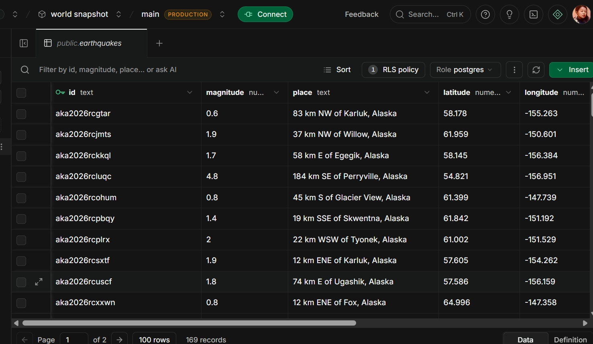
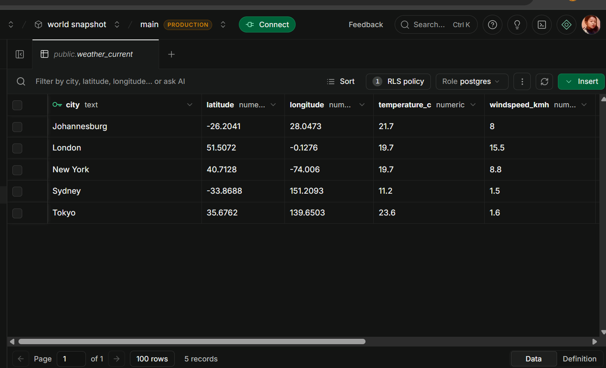
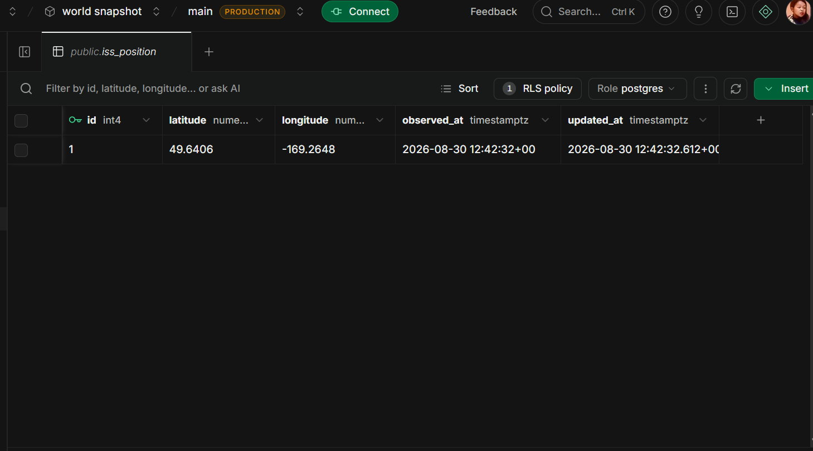

# Pulse, Submission

**Student:** Sja (Sijabulile Ncube)
**Project:** Pulse, A Live World Snapshot Board

---

## 🔗 Links

- **Live webpage (Netlify):** [PASTE NETLIFY LINK HERE]
- **GitHub repository:** [PASTE GITHUB LINK HERE]
- **Loom walkthrough:** [PASTE LOOM LINK HERE]

---

## 📋 Submission Checklist

| Requirement | File / Location |
| --- | --- |
| ✅ Database schema | `schema.sql` in the project root |
| ✅ Fetch script | `fetch.js` in the project root |
| ✅ Working webpage | `public/` folder, deployed on Netlify |
| ✅ Paragraph explaining table design | See below |
| ✅ Filter or sort (at least one) | Both filter and sort on the earthquakes panel |
| ✅ UPSERT to avoid duplicates | Used in all three tables in `fetch.js` |

---

## 🗄️ Database Schema

The full schema is in `schema.sql`. Here are the three `CREATE TABLE` statements:

```sql
-- 1. Earthquakes
create table if not exists earthquakes (
  id text primary key,
  magnitude numeric,
  place text,
  latitude numeric,
  longitude numeric,
  depth_km numeric,
  quake_time timestamptz,
  updated_at timestamptz not null default now()
);

-- 2. Weather
create table if not exists weather_current (
  city text primary key,
  latitude numeric,
  longitude numeric,
  temperature_c numeric,
  windspeed_kmh numeric,
  weathercode int,
  observed_at timestamptz,
  updated_at timestamptz not null default now()
);

-- 3. ISS Position
create table if not exists iss_position (
  id int primary key default 1,
  latitude numeric,
  longitude numeric,
  observed_at timestamptz,
  updated_at timestamptz not null default now(),
  constraint only_one_row check (id = 1)
);
```

### 📸 Screenshots from Supabase

**Earthquakes table:**



**Weather table:**



**ISS position table:**



---

## 📝 Paragraph: Why I Designed the Tables This Way

I designed each table around what makes the data unique in real life, instead of forcing all three tables to use the same shape. The `earthquakes` table uses the USGS earthquake ID as the primary key because every quake has its own permanent ID, so when the same quake comes back in a later fetch with updated info, the row just updates in place. The `weather_current` table uses the city name as the primary key because Open-Meteo does not give an ID, it only gives the current weather for a place, so I want one row per city that always holds the latest reading. The `iss_position` table only ever holds one row with a fixed ID of one, because there is only one ISS and only one current position worth showing. This design makes the upsert trick work cleanly across all three tables, since each key matches the real-world identity of the data.

---

## 🌍 Data Sources Used

1. **USGS Earthquake API**, for earthquakes in the last 24 hours worldwide
2. **Open-Meteo**, for current weather in five cities (Johannesburg, London, New York, Tokyo, Sydney)
3. **Open Notify**, for the current position of the International Space Station

---

## 🎛️ Filter and Sort

Both are on the earthquake panel:

- **Filter** by minimum magnitude (all, 2.5+, 4.0+, 6.0+)
- **Sort** by strongest first or newest first
